# 🖥️ Tkinter Mini Projects

A collection of **10 desktop GUI applications** built with Python and Tkinter, ranging from beginner to advanced level.

---

## 📋 Projects Overview

| # | Project |
|---|---------|
| 01 | [Calculator](#1-calculator) |
| 02 | [Unit Converter](#2-unit-converter) |
| 03 | [Quiz App](#3-quiz-app) |
| 04 | [Password Generator](#4-password-generator) |
| 05 | [Flashcard App](#5-flashcard-app) |
| 06 | [Drawing Board](#6-drawing-board) |
| 07 | [Expense Tracker](#7-expense-tracker) |
| 08 | [Text Editor](#8-text-editor) |
| 09 | [Snake Game](#9-snake-game) |
| 10 | [Personal Task Manager](#10-personal-task-manager) |

---

## Requirements

```bash
pip install pillow   # required for Drawing Board only
```

All other projects use only Python's standard library — no extra installs needed.

---

## Projects

### 1. Calculator

A clean, fully functional desktop calculator built with OOP.

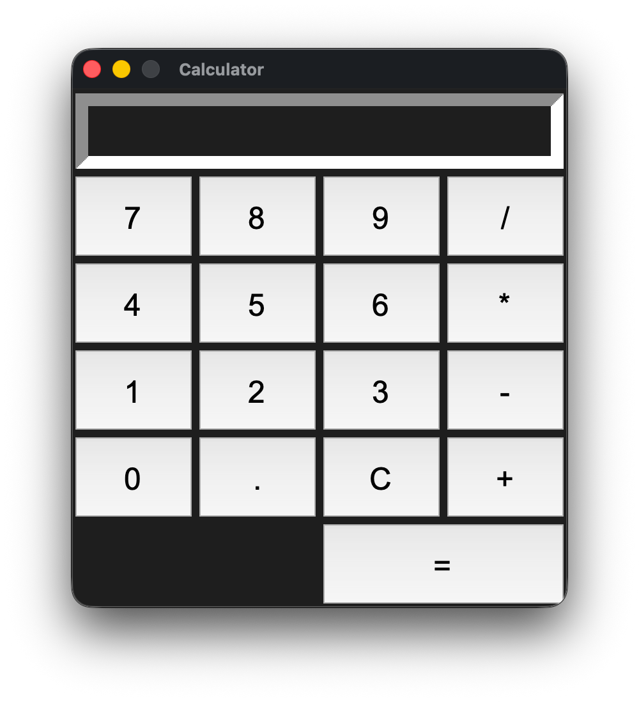

The calculator uses a `StringVar` to drive a read-only `Entry` display, and builds its button grid dynamically using a nested list loop — so adding or rearranging buttons is a one-line change. The `=` button spans two columns using `columnspan`. Keyboard support is handled through `root.bind`: digit and operator keys fire `button_click()`, `Return` triggers `=`, `Backspace` deletes the last character, and `Escape` clears the display. Division by zero and malformed expressions are caught separately and shown as friendly messages rather than raw exceptions.

**Features:**
- OOP design with a `Calculator` class
- Arithmetic: `+`, `-`, `*`, `/`, decimal support
- Read-only `Entry` display driven by `StringVar`
- Full keyboard support (numbers, operators, Enter, Backspace, Escape)
- Handles `ZeroDivisionError` and invalid expressions gracefully
- Results rounded to 10 decimal places to avoid float noise

---

### 2. Unit Converter

A live unit converter that updates results instantly as you type.

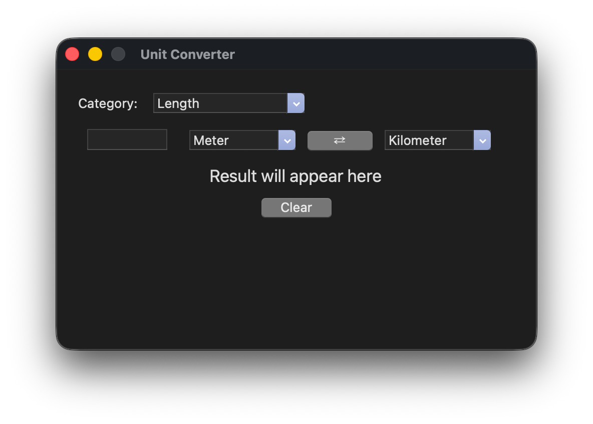

Conversion logic uses a base-unit table: every unit stores its value in SI units (e.g. 1 Mile = 1609.34 meters), so converting between any two units is just `value * from_factor / to_factor`. Temperature is handled separately with explicit Celsius-as-intermediate formulas. The input field is wired to a `StringVar` with `.trace_add("write", ...)`, so conversion fires on every keystroke without needing a button press. The swap button (`⇄`) swaps the two selected units and immediately reconverts.

**Features:**
- 3 categories: Length (5 units), Weight (4 units), Temperature (3 units)
- Live conversion on every keystroke via `StringVar.trace_add`
- Swap button to instantly reverse the conversion direction
- Clean aqua-themed UI using `ttk.Style`
- Clear button resets input and result
- Handles non-numeric input silently (no crash)

---

### 3. Quiz App

An interactive multiple-choice quiz with progress tracking.

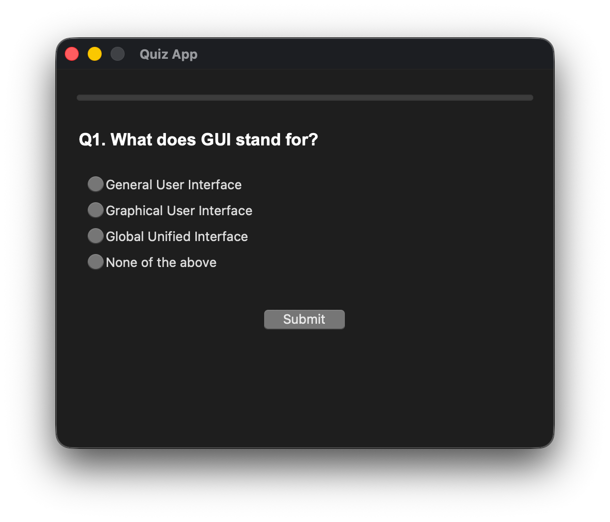

Questions and answers are stored as a list of dictionaries, making it trivial to add or edit questions. Each question renders a fresh set of `ttk.Radiobutton` widgets by destroying the previous ones — no manual state reset needed. The `ttk.Progressbar` advances after each submission. If the user tries to submit without selecting an answer, a `messagebox.showerror` blocks progression. On the final question, the submit button is hidden and the question area morphs into a score summary.

**Features:**
- 5 Tkinter-themed questions (easily extendable)
- `ttk.Progressbar` showing live quiz progress
- `ttk.Radiobutton` widgets rebuilt fresh for each question
- Blocks submission if no answer is selected
- Score summary screen shown at the end (no separate window)
- `IntVar` tracks which option is selected

---

### 4. Password Generator

A password generator with customizable character sets and one-click copy.

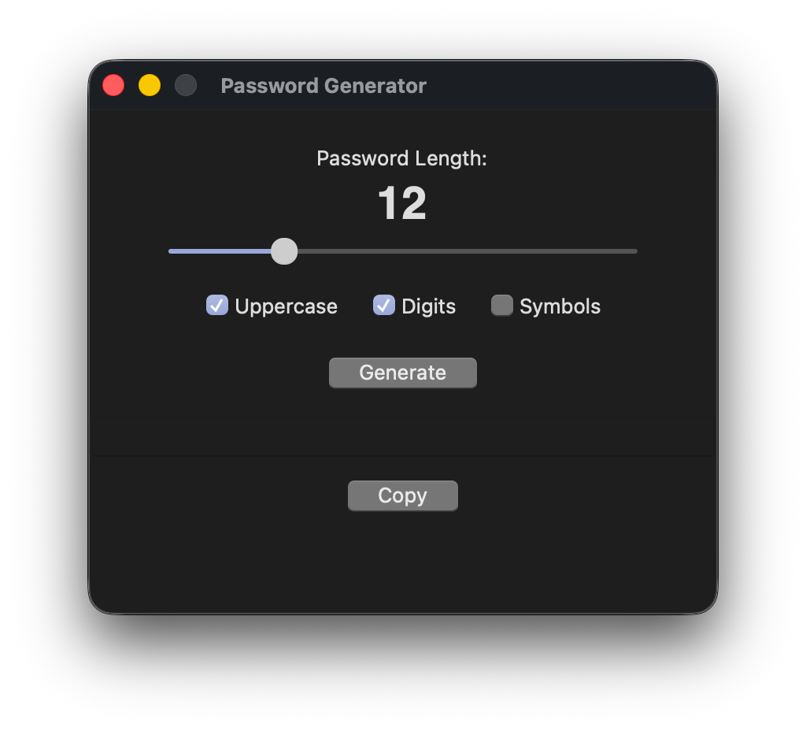

The character pool is built dynamically by concatenating string constants from Python's `string` module based on the active checkboxes. A `ttk.Scale` widget drives the length, and its value is traced with `DoubleVar.trace_add` to update the live length label in real time. The generated password is shown in a read-only `Entry`. Clicking Copy writes to the clipboard via `root.clipboard_append()` and temporarily changes the button text to "Copied!" — resetting after 1.5 seconds using `root.after()`.

**Features:**
- Adjustable password length via slider (6–32 characters)
- 3 toggleable character types: Uppercase, Digits, Symbols (lowercase always included)
- Password shown in a monospace read-only `Entry`
- Copy button with visual "Copied!" feedback that auto-resets after 1.5s
- Uses Python's `random.choices()` and `string` module for generation
- Graceful fallback if all checkboxes are unchecked

---

### 5. Flashcard App

A study flashcard app with card flipping, scoring, and session tracking.

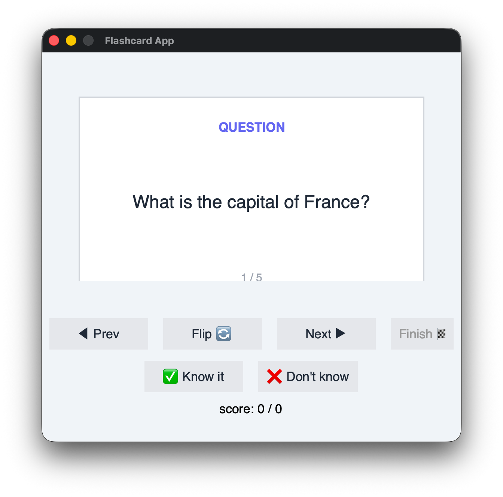

Cards are drawn on a `tk.Canvas` — a white rectangle with text rendered on top, so the "flip" is simply a redraw with different content and color. The app tracks whether the current card has been answered to avoid double-counting: clicking "Know it" or "Don't know" only records the score if the card was flipped first, and `card_answered` prevents counting the same card twice when navigating. On the last card, the Next button is disabled and Finish becomes active. The finish flow checks for a perfect score and offers a retry dialog if not.

**Features:**
- Canvas-based card display (question in indigo, answer in green)
- Card flip animation (instant redraw with label + color change)
- Prev / Next / Flip / Finish navigation
- "Know it ✅ / Don't know ❌" scoring — only counts after a flip
- Score tracked as `correct / total_answered`
- Finish screen with perfect-score detection and retry/quit dialog
- Full session reset on retry

---

### 6. Drawing Board

A canvas drawing app with shape tools, color picker, and image export.

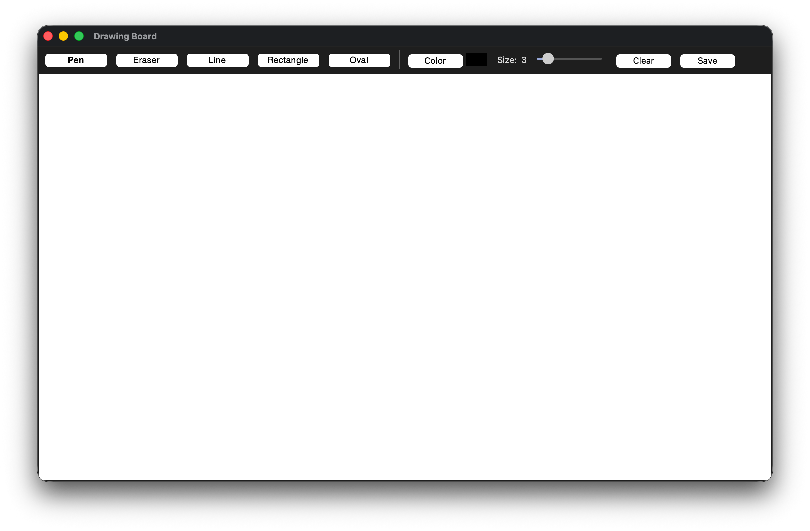

The toolbar is built in a loop — tool buttons are stored in a dict by name so the active one can be highlighted with `relief="sunken"` and bold font. Drawing is split into three canvas events: `<ButtonPress-1>` records the start point, `<B1-Motion>` draws (freehand for Pen/Eraser, preview shape for Line/Rectangle/Oval), and `<ButtonRelease-1>` finalizes. Shape preview works by deleting and redrawing a `temp_item` on every drag event. The eraser draws a white oval at 3× brush size. Saving uses `PIL.ImageGrab.grab()` to capture the canvas pixel region directly.

**Features:**
- 5 tools: Pen (freehand), Eraser, Line, Rectangle, Oval
- Live shape preview while dragging
- Color picker via `colorchooser.askcolor()`
- Color swatch label updates to show current color
- Adjustable brush size (1–20) via `ttk.Scale` with live size label
- Active tool highlighted (bold + sunken relief)
- Clear button wipes the canvas
- Save as PNG using `PIL.ImageGrab` (requires Pillow)

---

### 7. Expense Tracker

A dark-themed expense manager with table view and CSV persistence.

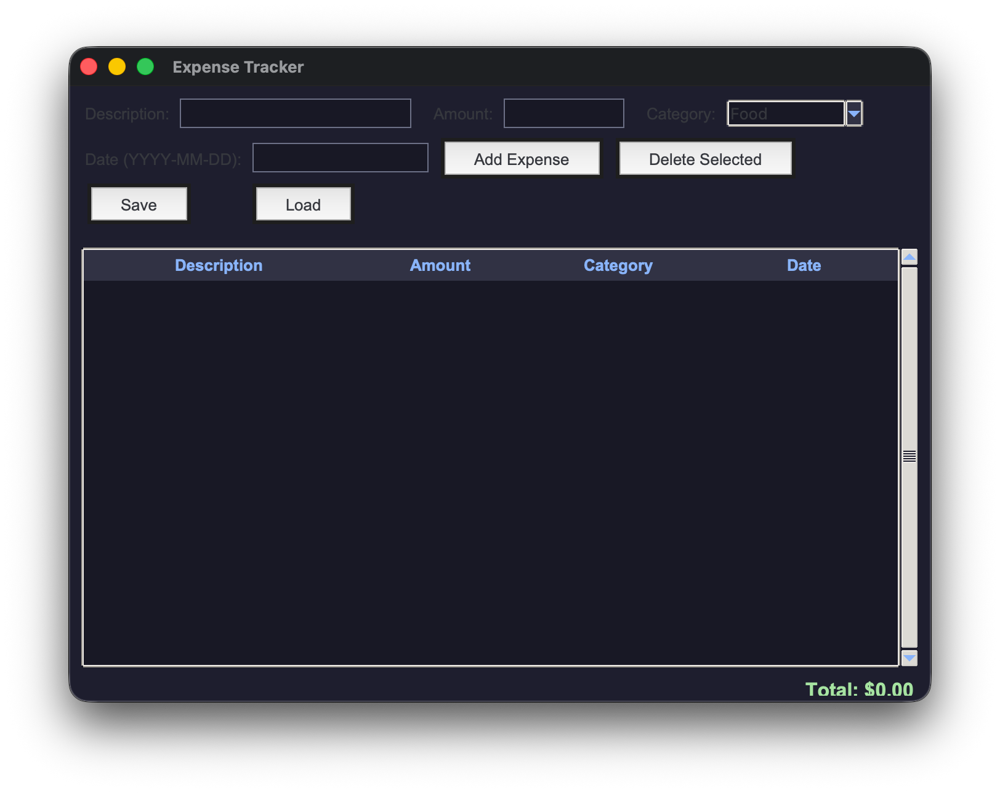

The entire color scheme is defined as module-level constants (Catppuccin-inspired palette), applied through a custom `ttk.Style` configuration and helper methods (`_label`, `_entry`, `_button`) that centralize widget styling. The `ttk.Treeview` shows expenses in a scrollable table with four columns; a running total is computed by iterating all rows and stripping the `$` prefix. Expenses are saved/loaded as CSV files with a header row using Python's `csv` module. All keyboard shortcuts are registered on `root` so they work regardless of which widget has focus.

**Features:**
- `ttk.Treeview` table with columns: Description, Amount, Category, Date
- Categories: Food, Transport, Bills, Shopping, Other
- Running total displayed in green at the bottom
- CSV save and load via `filedialog`
- Keyboard shortcuts: `Cmd+S` (save), `Cmd+O` (open), `Delete` (remove row), `Enter` (add)
- Full dark UI with Catppuccin-inspired color palette
- Helper factory methods for consistent widget styling
- Input validation with specific error messages

---

### 8. Text Editor

A fully featured desktop text editor with menus, formatting, and Find & Replace.

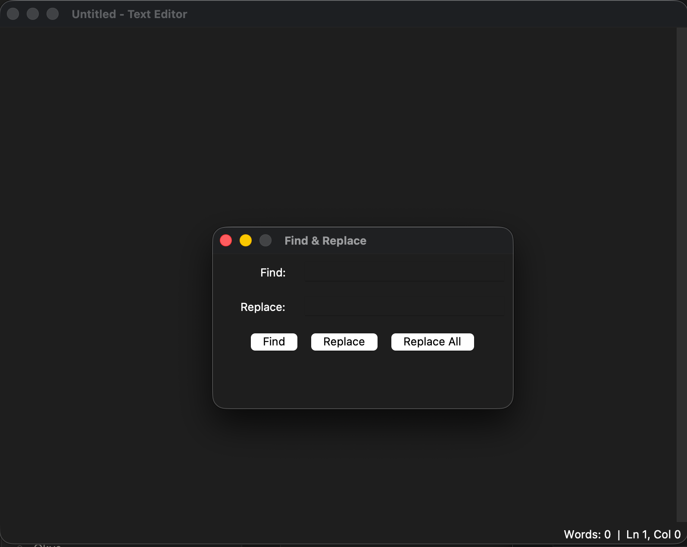

The editor is structured around a `tk.Text` widget with `undo=True`, giving free undo/redo without any manual history management. Three menus (File, Edit, Format) are built in separate methods to keep `__init__` clean. Font state is tracked with four instance variables (`font_family`, `font_size`, `font_bold`, `font_italic`) and applied together via `apply_font()` — so toggling bold while italic is active correctly produces a `"bold italic"` compound style. Find & Replace is implemented as a separate `FindReplaceDialog` class using `tk.Toplevel`. The `find()` method highlights all matches with a `"found"` tag (yellow background) and returns the index of the first match for single replace. The status bar tracks word count and cursor position on every key and click event.

**Features:**
- **File menu:** New, Open, Save, Save As (with unsaved-changes warning)
- **Edit menu:** Undo, Redo, Cut, Copy, Paste, Select All, Find & Replace
- **Format menu:** Font Family, Font Size, Bold, Italic
- Find & Replace dialog (separate `FindReplaceDialog` class): highlights all matches, single replace, replace all
- Status bar: live word count + line/column position
- Unsaved changes warning before New/Open/Exit
- Keyboard shortcuts: `Cmd+Z/Shift+Z`, `Cmd+A`, `Cmd+F`
- `tk.Text` with `undo=True` for free undo history

---

### 9. Snake Game

A complete Snake game with full OOP architecture, animations, and difficulty settings.

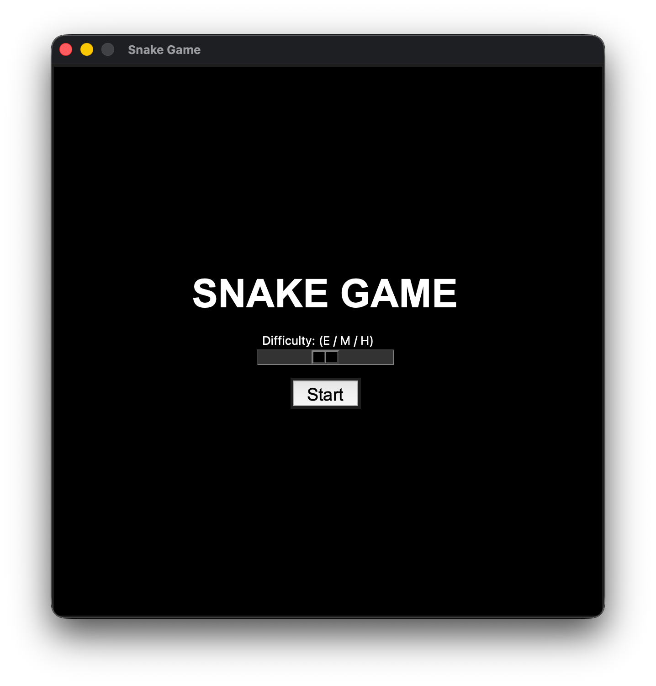
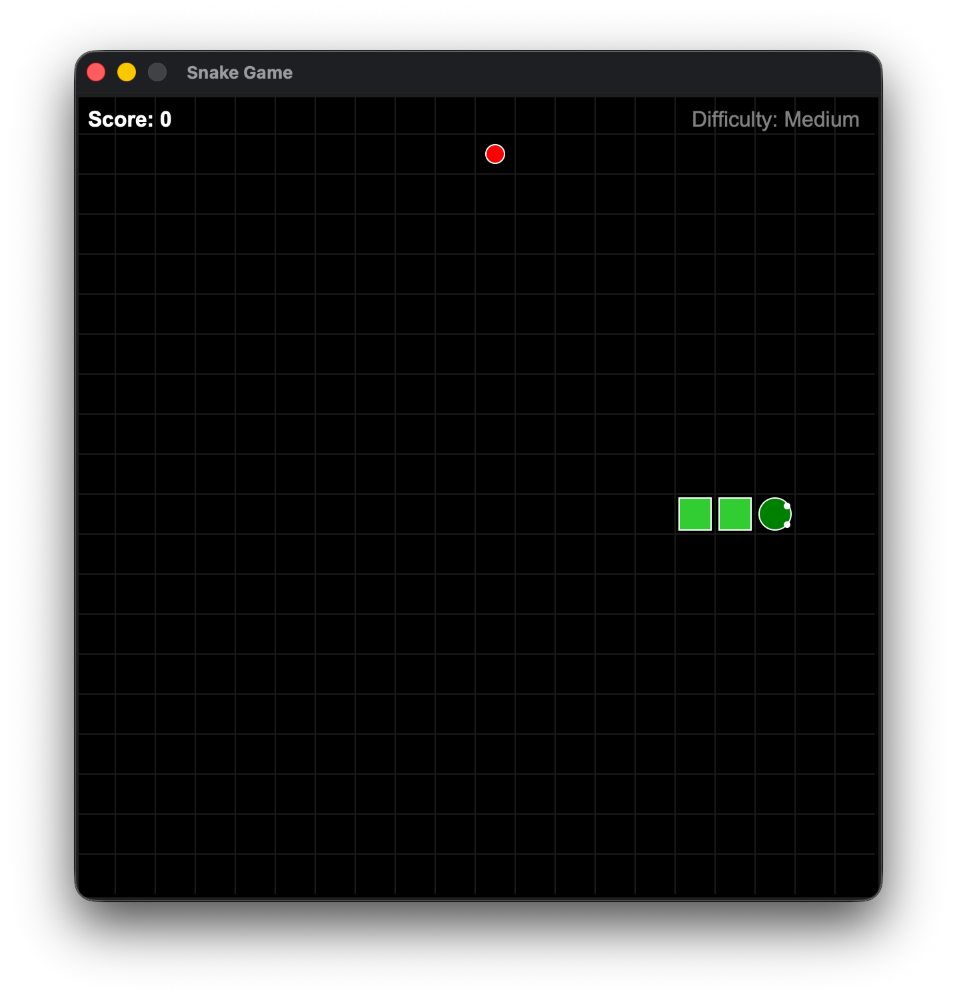

The game is split into three classes: `Snake` manages the body list, movement, growth, and eye drawing; `Food` handles random placement (avoiding the snake body); `TheGame` owns the canvas, game loop, and all screens. The game loop runs via `root.after(speed, self.update)` — cancellable by simply not rescheduling. Difficulty changes speed: Easy=200ms, Medium=150ms, Hard=80ms per tick. The snake head is drawn as an oval with two white eye dots that shift position based on the current direction. Collision detection checks both wall boundaries and self-intersection using `list.count(head) > 1`. A win condition triggers when the snake fills the entire grid (`GRID_COUNT² = 400` cells). Six edge-case bugs were identified and fixed during development (reverse direction, double-count on grow, eye offset at all 4 directions, food spawning on snake, etc.).

**Features:**
- Full OOP: `Snake`, `Food`, `TheGame` classes
- Animated snake head (oval with direction-aware eyes)
- 3 difficulty levels via `tk.Scale` (Easy / Medium / Hard)
- Start screen, Game Over screen, Win screen, Restart
- HUD: live score + difficulty label
- Background grid drawn with canvas lines
- Arrow key controls with reverse-direction prevention
- Win condition: fill the entire 20×20 grid
- 6 edge-case bugs fixed

---

### 10. Personal Task Manager

A feature-rich task manager with priority system, search, and JSON persistence.

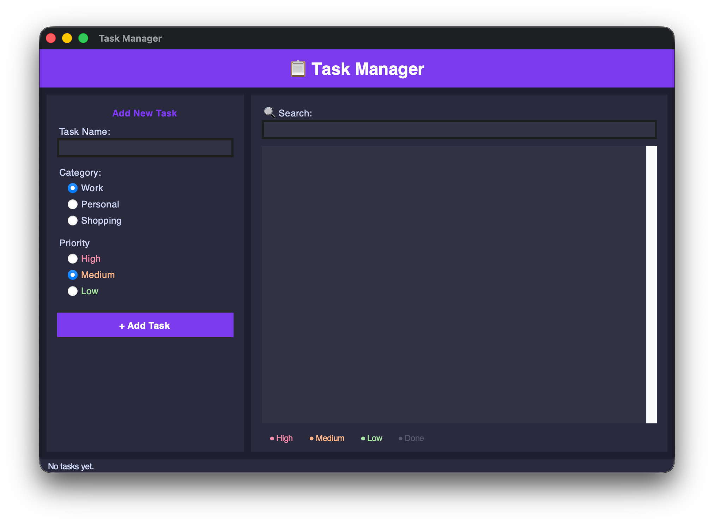

Tasks are stored as a list of dicts in memory and serialized to JSON on save. The UI is split into a fixed-width left panel (add task form) and an expanding right panel (task list + search). Color coding is applied per-item in the `tk.Listbox` using `itemconfig(index, fg=color)` after each insert. The search filter works via `StringVar.trace_add` — on every keystroke it rebuilds the listbox with only matching tasks, while `filtered_indices` maps visible positions back to the original task list indices (so delete and toggle operate on the correct task even when the list is filtered). A menu bar provides File (New/Open/Save) and Edit (Delete/Mark) commands, all also wired as keyboard shortcuts.

**Features:**
- Left panel: add tasks with Name, Category (Work / Personal / Shopping), Priority (High / Medium / Low)
- Right panel: scrollable task list with live search filter
- Color-coded tasks: High 🔴, Medium 🟠, Low 🟢, Done ⚫
- Toggle task done/undone (Space or double-click)
- Delete with confirmation dialog
- Live search via `StringVar.trace_add` with index remapping
- Status bar: total / done / remaining counts
- JSON save and load via `filedialog`
- Menu bar with File and Edit menus
- Keyboard shortcuts: `Cmd+N`, `Cmd+O`, `Cmd+S`, `Delete`, `Space`
- Dark purple theme

---

## 🚀 How to Run

```bash
# Clone the repo
git clone https://github.com/your-username/tkinter-mini-projects.git
cd tkinter-mini-projects

# Run any project
python 1_Calculator/Calculator.py
```

---

## 🛠️ Built With

- **Python 3.x**
- **Tkinter** — standard GUI library
- **Pillow** — image handling (Drawing Board only)

---

## 📄 License

This project is licensed under the [MIT License](LICENSE).

---

Built by **Amirali**
